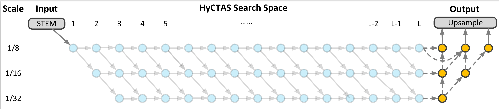
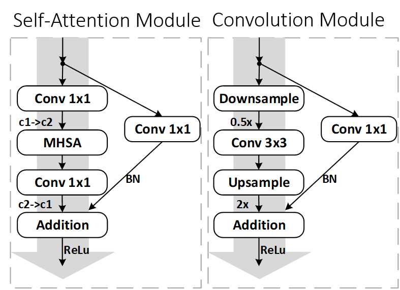
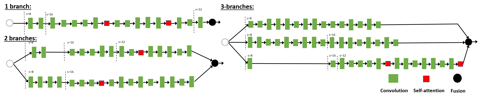

# HyCTAS: Real-Time Image Segmentation via Hybrid Convolutional-Transformer Architecture Search

<div align="center">

<h2><a href="https://arxiv.org/abs/2403.10413">Real-Time Image Segmentation via Hybrid Convolutional-Transformer Architecture Search</a></h2>

[Hongyuan Yu](https://hongyuanyu.github.io/), [Cheng Wan](https://jornywan.github.io/), [Mengchen Liu](https://scholar.google.com/citations?user=cOPQtYgAAAAJ&hl=zh-CN), [Dongdong Chen](https://scholar.google.com/citations?user=sYKpKqEAAAAJ&hl=en&oi=ao), [Bin Xiao](https://scholar.google.com/citations?user=t5HZdzoAAAAJ&hl=en&oi=ao) and [Xiyang Dai](https://scholar.google.com/citations?user=QC8RwcoAAAAJ&hl=en&oi=ao)

[](https://arxiv.org/abs/2403.10413)

</div>

## Overview

We develop a multi-target multi-branch supernet method, which not only retains the
multi-branch structure of HRNet, but also finds the proper location for placing multi-head self-attention module. Our search algorithm is optimized towards multiple objectives (e.g., latency and mIoU) and capable of finding architectures on Pareto frontier with arbitrary number of branches in a single search. We further present a series of HyCTAS that searched for the best hybrid combination of light-weight convolution layers and memory-efficient self-attention layers between branches from different resolutions and fuse to high resolution for both efficiency and effectiveness.

<p align="center">
  </br>
  <span align="center">HyCTAS search space</span>
</p>

<p align="center">
  </br>
  <span align="center">HyCTAS searchable modules</span>
</p>


Highlights:
* **1**: We design a novel searching framework incorporating with multi-branch space for high resolution representation and genetic-based multi-objective.
* **2**: We present a series of HyCTAS that combines a light-weight convolution module to reduce the computation cost while preserving high-resolution information and a memory efficient self-attention module to attend long-range dependencies.
* **3**: HyCTAS achieves extremely fast speed, low flops, low parameters and maintains competitive accuracy.

## Results
<p align="center">
  </br>
  <span align="center">HyCTAS models</span>
</p>


## Prerequisites
- Ubuntu 16.04
- Python 3.7
- CUDA 10.2 (lower versions may work but were not tested)
- NVIDIA GPU (>= 11G graphic memory) + CuDNN v7.3

This repository has been tested on GTX 2080Ti. Configurations (e.g batch size, image patch size) may need to be changed on different platforms.

## Installation
* Clone this repo:
```bash
git clone https://github.com/HyCTAS/HyCTAS.git
cd HyCTAS
```
* Install dependencies:
```bash
bash install.sh
```

## Usage
### 0. Prepare the dataset
* Download the [leftImg8bit_trainvaltest.zip](https://www.cityscapes-dataset.com/file-handling/?packageID=3) and [gtFine_trainvaltest.zip](https://www.cityscapes-dataset.com/file-handling/?packageID=1) from the Cityscapes.
* Prepare the annotations by using the [createTrainIdLabelImgs.py](https://github.com/mcordts/cityscapesScripts/blob/master/cityscapesscripts/preparation/createTrainIdLabelImgs.py).
* Put the [file of image list](tools/datasets/cityscapes/) into where you save the dataset.


### 1. Train from scratch
* `cd HyCTAS/train`
* Set the dataset path via  `ln -s $YOUR_DATA_PATH ../DATASET`
* Set the output path via `mkdir ../OUTPUT`
* Train from scratch
```
export DETECTRON2_DATASETS="$Your_DATA_PATH"
NGPUS=8
python -m torch.distributed.launch --nproc_per_node=$NGPUS train.py --world_size $NGPUS --seed 12367 --config ../configs/cityscapes/semantic.yaml
```

### 2. Evaluation
We provide training models and logs, which can be downloaded from [Google Drive](https://drive.google.com/drive/folders/10jR2H5JwuJq9UuPGWutyw50MHESBZZ3w?usp=sharing).

```bash
cd train
```
* Download the pretrained weights of the from [Google Drive](https://drive.google.com/drive/folders/10jR2H5JwuJq9UuPGWutyw50MHESBZZ3w?usp=sharing).
* Set `config.model_path = $YOUR_MODEL_PATH` in `semantic.yaml`.
* Set `config.json_file = $HyCTAS_MODEL` in `semantic.yaml`.
* Start the evaluation process:
```bash
CUDA_VISIBLE_DEVICES=0 python test.py
```

## Cite

If you find this repository useful, please use the following BibTeX for citation.

```latex
@misc{yu2024realtime,
      title={Real-Time Image Segmentation via Hybrid Convolutional-Transformer Architecture Search}, 
      author={Hongyuan Yu and Cheng Wan and Mengchen Liu and Dongdong Chen and Bin Xiao and Xiyang Dai},
      year={2024},
      eprint={2403.10413},
      archivePrefix={arXiv},
      primaryClass={cs.CV}
}
```
